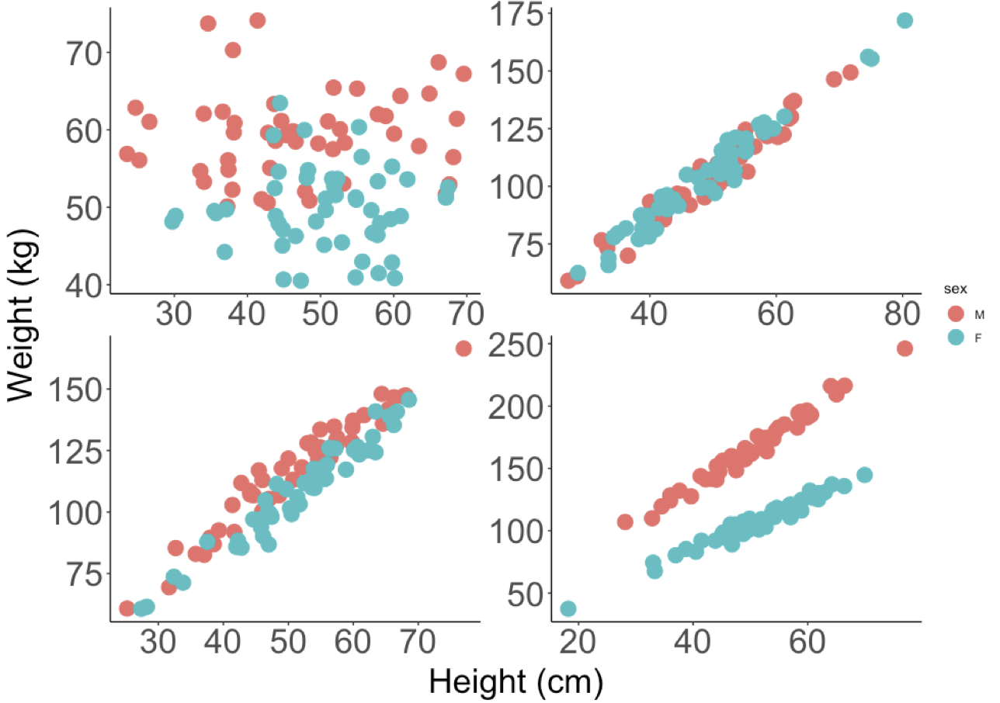

--- 
title: "An Introduction to Experimental Design ANOVA and ANCOVA"
author: "Andrew P Beckerman (with support from text and slides from Mark Rees and Gareth Phoenix)"
date: "`r Sys.Date()`"
site: bookdown::bookdown_site
output: bookdown::gitbook
documentclass: book
link-citations: yes
description: "This is an introduction to Experimental Design, ANOVA and ANCOVA analyses."
---

```{r,echo = FALSE, message=FALSE, warning=FALSE}
library(tidyverse)
```

# Introduction

Welcome to An Introduction to Experimental Design ANOVA and ANCOVA

In this mini-module, you'll be learning about the principles of experimental design and analysis of a few classic designes, the 2x2 ANOVA and ANCOVA experiments.

This module is compulsory for all, because it forms the foundation for most of the more complex experiments you will do as a researcher.  And it is the major step beyond the t-test, 1-way ANOVA, simple regression and chi-square contingency table analyses we've covered thus far.

The learning outcome for this mini-module are that you will understand the basic ideas about

- Replication, Randomisation and Reducing Noise
- Precision, Bias and Systematic Error
- The Completely Randomised Design
- The Randomised Block Design
- The 2-way ANOVA
- The ANCOVA Design

In order to be successful with this final section of the course, you need to feel comfortable with the 1-way ANOVA and the Regression model.  Please review these concepts.  You can also refer to Chapter 5 and 6 in Getting Started with R (available as an online Resource via STARPlus) which covers a great deal of the mechanics of using R to do these types of models. Finally, you will also need to feel comfortable with dplyr and ggplot - we'll be reinforcing the old stuff and introducing a few new tricks.

## The Three Rs: The Foundation of Experimental Design.

Before we get started, it's vital that you understand that there are some very basic principles needed to ensure that your experiments can provide robust and reliable inference (answers to your questions).  The “3 R’s”. 

- **Randomisation**: the random allocation of treatments to the experimental units, to avoid confounding between treatment effects and other unknown effects.
- **Replication**: the repetition of a treatment within an experiment, to quantify the natural variation between experimental units and increase accuracy of estimated effects.
- **Reduce noise:** by controlling as much as possible the conditions in the experiment, e.g. by grouping of similar experimental units in blocks.

At this point, you may want to revisit, again, the following section of the APS 240 book [on Randomisation](https://dzchilds.github.io/stats-for-bio/principles-experimental-design.html#randomisation)

## The General Linear Model

This section of the course is focused on a class of model called the General Linear Model.  It is not a **GLM**.  The **GLM** is a generalised linear model.  I know, right?

The general linear model is, as we learned in the past few weeks, a model fit in R with the `lm()` function.  It includes regression, ANOVA, ANCOVA and variations of these.  

There are a few key characterstics to remember about these models. The general linear model has the following form:

$y = \beta_{0}+\beta_{1}*X_{1}+\beta_{2}*X_{2}+\epsilon$

Where the $y$ is the response variable, the $\beta$'s are estimated parameters, the $X$'s are the predictor variables and the $\epsilon$ comes from a Gaussian distribution with zero mean and constant variance.

Let's decompose that a bit more.

There are two types of predictor variable:

_Metric_ predictor variables are measurements of some quantity that may help to predict the value of the response. For example, if the response is the blood pressure of patients in a clinical trial, then age, fat mass and height are potential metric predictor variables.  You may know these as **continuous explanatory (independent) variables**

_Factor_ variables are labels that serve to categorize the response measurements into groups, which may have different expected values. Continuing the blood pressure example, factor variables might be sex and drug treatment received (drug A, drug B or placebo, for example).  You may also know these as **categorical explanatory (independent) variables**.

So, you hopefully can see how this _general_ linear model is capable of representing

1. *ANOVA* – Analysis of variance -> Predictors are factors.
2. *Regression* -> Predictor is a metric variable (continuous variable).                  
3. *Multiple regression* -> Predictors are metric variables (continuous variables). 
4. *ANCOVA* - Analysis of co-variance -> Predictors are a mixture of metric variables (continuous variables) and factors.

Finally, it is important to understand that non-linear relationships such as these data below can be modelled with a linear model:

```{r, echo = FALSE}
# set x range
x <- -100:100
# define y without error
y_det <- 0.01+x^2
# add some random variation
y <- y_det+rnorm(length(x),0,1000)

# create dataframe and plot
df <- data.frame(x, y)
ggplot(df, aes(x = x, y = y))+
  geom_point()
```

How, you ask!?  Well.... consider this equation:

$y = 0.01 + x + x^{2} + \epsilon$

Referring to our generic model structure above, 

$y = \beta_{0}+\beta_{1}*X_{1}+\beta_{2}*X_{2}+\epsilon$

we hopefully can see that $\beta_{0} = 0.01$, $\beta_{1} = 0$ and $\beta_{2} = 1$, where $X_{2} = X^{2}$!

Linear models are perfectly capable of being used to estimate non-linear relationships!

Here is the code to make that figure.

```{r, eval = FALSE}
# set x range
x <- -100:100
# define y without error
y_det <- 0.01+x^2
# add some random variation
y <- y_det+rnorm(length(x),0,1000)

# create dataframe and plot
df <- data.frame(x, y)
ggplot(df, aes(x = x, y = y))+
  geom_point()
```

# Readings ----

There are several resources that will help with this section of the stats course, and onwards

- Getting Started with R - An Introducton for Biologists, Second Edition (available as an electronic online resource via StarPlus).  Specifically Chapter 5 and 6.
- Experimental Design for the Life Sciences - Nick Colegrave and Graham Ruxton (seen on eBay for £2.50!)
- Of course, the venerable coursebook for APS 240: https://dzchilds.github.io/stats-for-bio/index.html

## Install some extra packages ----

In order to make this module more effective, we are going to use some additional resources from CRAN.

Please install these packages, if you have not already, using the install packages tab in RStudio:

- `tidyverse`
- `ggfortify`
- `agricolae`
- `car`
- `gmodels`
- `visreg`
- `patchwork`

<!--chapter:end:index.Rmd-->

# Introduction To Experimental Design {#intro}

Experiments help us answer questions, but there are also non-experimental techniques. What is so special about experiments? 

One of the central features of an experiment is the _treatment_ - a manipulation of some variable of interest that should have an effect on the response variable we are investigating.  Whether you are manipulating the levels of a hormone to explore it's impact on a cell/organ or embryo development, the concentration of a drug to explore it's efficancy in treating a disease or the levels of nitrogen in soil to explore the impacts on plant growth, a treatment is a deliberate manipulation.  

It is also important to remember that there can be _natural_ treatments - there may be natural variation among cells, organisms or gradients in the environment that you can use to represent treatments.  

So, to be very clear:

1. Experiments allow us to set up a direct comparison among the _levels_ or _values_ of *treatments* of interest.
2. We can design experiments to minimize any bias in the comparison.
3. We can design experiments so that the error in the comparison is small.
4. We design experiments to be in control, and having that control allows us to make stronger inferences about the nature of differences that we see in the response variable. 

> Experiments allow us to move towards making inferences about causation.

This last point distinguishes an experiment from an observational study. In an observational study we merely observe which units are in which treatment groups; we don’t get to _control that assignment_.  This underpins the classic issue with assigning _causation to correlation_ - in the following two examples, there is a strong association between the variables, but there has been no control/manipulation.

```{r, echo = FALSE}
knitr::include_graphics("images/IceCream_Shark.png")
knitr::include_graphics("images/Autism_Organic.png")
```

## Conepts associated with causation

Mosteller and Tukey (1977) list three concepts associated with causation and state that at least two (preferably all three) are needed to support a causal relationship:

- *Consistency* – make a change and the response is in the same direction or the amount of response is _consistent_ across populations
- *Responsiveness* – make a change and the response changes according to theory
- *Mechanism* – make a change and we can monitor/identify a mechanism leading from cause to effect

Let's look at a classic example.  Smoking and lung cancer – from 1922 to 1947 annual deaths for lung cancer went from 612 to 9287 (Observation). This was thought in the 1950s to be either an effect of smoking tobacco or atmospheric pollution (Hypothesis). Numerous studies showed that lung cancer was more prevalent in smokers (Observation: *consistency*). Chemical analyses of tobacco showed it contained carcinogens (Association: *mechanism*). Public health programs resulted in a reduction in smoking and lung cancer rates decreased (Intervention: *responsiveness*). 

Note the initial study was an observational study and in this case it was not ethical to do the experiment per se!

## Components of an Experiment

An experiment has _treatments, experimental units, responses, and a method to assign treatments to units_.  These four things specify the experimental design.

Not all experimental designs are created equal. A good experimental design must adhere to the 3Rs. It should reveal consistency, responsiveness and mechanism.  The way this happens is by avoiding systematic error in measuring things, and allow estimation of error in measurements with precision.  

## The holy grail of a control

At this point, it would be good to revisit the APS 240 sections [on controls](https://dzchilds.github.io/stats-for-bio/principles-experimental-design.html#experimental-control) and [procedural controls](https://dzchilds.github.io/stats-for-bio/principles-experimental-design.html#EXPT-DESIGN-PROCEDURAL-CONTROLS)

## So what does a good experimental design do?

In short, a good experimental design must:

- Avoid systematic error
- Allow estimation of error
- Be precise
- Have broad validity.

Lets walk through some definitions.

If our experiment has _systematic error_, then our comparisons will be biased, no matter how precise our measurements are or how many experimental units we use. **Randomisation** is our tool to combat _systematic error_.

Even without _systematic error_, there will be random error in the responses - this is what we call variation in what we are measuring or more formally variance.  Such variation in responses invariably leads to random error in the treatment comparisons.  When we compared two means in the t-test, we had to deal with the variation in both groups! 

Experiments are precise when this random error in the treatment comparisons is small. Precision depends on the size of the random errors in the responses, the number of units used (**replication**), and the experimental design used.

Experiments must be designed so that we have an estimate of the size of random error. This permits statistical inference: for example, confidence intervals (which arise from standard errors) or tests of significance based on t- or F-statistics. 

We cannot do inference without an estimate of this variation. We would like our conclusions to be valid for a wide population, so we need to *randomise* our subjects or objects we are measuring - for example, we may need to be aware of both sexes and of young and old individuals.  But there are always compromises - for example, broadening the scope of validity by using a variety of experimental units may decrease the precision of the responses.

## How do we increase precision and reduce bias?

There are several key concepts

### Blinding
_Blinding_ occurs when the evaluators of a response do not know which treatment was given to which unit. Blinding helps prevent bias in the evaluation, even unconscious bias from well-intentioned evaluators. Double blinding occurs when both the evaluators of the response and the (human subject) experimental units do not know the assignment of treatments to units. Blinding the subjects can also prevent bias, because subject responses can change when subjects have expectations for certain treatments.

### Placebos
_Placebo_ is a null treatment that is used when the _act_ of applying a treatment— any treatment — has an effect. Placebos are often used with human subjects, because people often respond to the process of receiving any treatment: for example,
reduction in headache pain when given a sugar pill. Blinding is important when placebos are used with human subjects. Placebos are also useful for nonhuman subjects. The apparatus for spraying a field with a pesticide may compact the soil. Thus we drive the apparatus over the field, without actually spraying, as a placebo treatment.

### Confounders
_Confounding_ occurs when the effect of one factor or treatment cannot be distinguished from that of another factor or treatment. The two factors or treatments are said to be confounded. Except in very special circumstances, confounding should be avoided. Consider the following example.  We plant corn variety A in Yorkshire and corn variety B in Lancashire. In this experiment, we cannot distinguish location effects (Yorkshire vs. Lancashire) from variety effects (cornA vs. cornB) — the variety factor and the location factor are confounded.

This is despite the fact that we know that Yorkshire will be better.... (that's a joke)

## Experimental vs. Measurement units

A common source of difficulty in designing experiments is the distinction between experimental units and measurement units.  We need to know the experimental units, as this is the key value used to generate our inference. 

Now is a good time to re-look at the short section on [Jargon Busting](https://dzchilds.github.io/stats-for-bio/principles-experimental-design.html#jargon-busting) from the APS 240 book.

### Experimental and measurement units: an example

Consider an educational study, with six classrooms of 25 pupils. Each classroom of students is then assigned, at random, to one of two different reading programmes.  

At the end of a six-week term, all the students are evaluated via a common reading exam.

#### The challenge question

> Are there six experimental units (the classrooms) or 150 (25*6; the students)?  We measured the reading ability of the students... but they were in classroom sets of 25....

###  Identifying the experimental unit - an example of **pseudo-replication**

To identify the experimental units the key question is: To which _thing_ (students or classrooms) did we randomly allocate our treatments?

If we randomly allocated reading programmes to students, then students would be the experimental units. But we didn't, so the classroom is the experimental unit – it is the classroom to which we randomly allocated treatments.  

_The classroom is the experimental unit_.   

However, you are right - we don’t _measure_ how a classroom reads; we measure how students read. Thus _students are the measurement units_ for this experiment.

### Psudo-replication

Confusing these two things can lead to **pseudo-replication**. Treating measurement units as experimental usually leads to overoptimistic analysis — we will reject null hypotheses more often than we should, and our confidence intervals will be too narrow. The usual way around this is to determine a single response for each experimental unit. 

There is additional information on [Independence and Pseudoreplication](https://dzchilds.github.io/stats-for-bio/principles-experimental-design.html#independence) in the the APS 240 book.

#### Independence: and example
Consider an experiment with two growth chambers each containing 100 plants. One of the chambers received enhanced C02. One night after collecting data you leave the door open on the C02 chamber and the temperature drops and so the plants grow more slowly. When you come to analyze the data you get a highly significant effect of slow growth.  However, that C02 results in reduced plant growth not what you expect (CO2 is good for photosynthesis...). 

This is an entirely plausible outcome caused by misallocating plants as the experimental unit - it was really the CO2 chamber... to avoid such problems, one needs many chambers.

Consider a second experiment where you have 200 growth chambers and randomly allocate plants to each. If you _forget to close one door_ it really has no effect as just one plant is affected.  In fact, to get the same effect as in the first experiment you would have to accidentally leave the doors open on all 100 of the elevated C02 chambers. This is very unlikely indeed!!!

> There are 9 x 1058 ways selecting 100 chambers from 200 chambers so the chance of accidentally picking all the elevated C02 chambers is 1/ 9x10580 (stars in universe 7 x 1022).

Proper **randomization** and **replication** is very different from **pseudo-replication**.

### Randomization with Replication protects against Confounding

An experiment is properly randomized if the method for assigning treatments to units involves a known, well-understood probabilistic scheme. The probabilistic scheme is called a randomization.

> In general, more experimental units with fewer measurement units per experimental unit works better. 

No matter which features of the population of experimental units are associated with our response, our randomizations should put approximately _half the individuals with these features_ into _each treatment group_.

Recall our example above of considering sex and age of subjects and imagine a treatment with two levels (hot and cold).  Done well, proper randomisation will put approximately half the males, half the females, half the older, half the younger etc into each of the treatment levels.

The beauty of randomization is that it helps prevent *confounding*, even for factors that we do not know are important.

### **haphazard** is NOT randomized - beware the non-randomized experiment –

A company is evaluating two different word processing packages for use by its clerical staff. Part of the evaluation is how quickly a test document can be entered correctly using the two programs. We have 20 test secretaries, and each secretary will enter the document twice, using each programme once.

Suppose that all secretaries did the evaluation in the order A first and B second. Does the second programme have an advantage because the secretary will be familiar with the document and thus enter it faster? Or maybe the second programme will be at a disadvantage because the secretary will be tired and thus slower?

Randomization generally costs little in time and trouble, but it can save us from `disaster`.  The experiment above needs secretaries randomly assigned to A first -> B second and B first -> A second (50% in each!).

Anything that might affect your responses should be *randomized*! For example

- If the experimental units are not used simultaneously, you can (should) randomize the order in which they are used.
- If the experimental units are not used at the same location, you can (should) randomize the locations at which they are used.
- If you use more than one measuring instrument for determining response, you can (should) randomize which units are measured on which instruments.

## Mini-Quiz

> A PhD student want to determine the effects of protein on beetle reproduction, so they design an experiment with a control and protein enhanced diet. To assign beetles to each of the treatments they pour a culture onto the table and catch the first 30 beetles that run to the edge of the table, these receive the protein enhanced diet. The next 30 beetles go in the control. **Is this randomized?** 

(Hmm .... is there anything about the first 30 beetles that reach the edge of the table that could *bias* your inference?)

## Replication: How many? 

There is a really common question that people ask.  How many replicates do I need?  Unfortunatly, there are no simple rules... it depends... on....

- Resources available ($/£/€ and equipment and time)
- Variability of experimental units
- Treatment structure 
- Size of effect (response)
- Relative importance of different comparisons

There is, however, a set of tools that can help with estimating sample sizes.  It's called power analysis and requires that you have some a priori estimate of the expected variation in your response variable.


<!--chapter:end:02-Experiments_and_Some_Philosophy.Rmd-->

# Examples and Challenge Questions

In this section, we will review a field based experimental design example.  There are challenge questions to answer.

We will also introduce tools to generate randomised experimental designs - this is a good trick to have up your sleeves!

## Designing your first experiment

You are challenged to design an Arctic field manipulation experiment to evaluate UV-B radiation and increased CO2 impacts on plant growth.

Context: an arctic tundra study 
Increasing ultraviolet-B (+UV-B) radiation from ozone depletion (the arctic ozone hole)
Increasing atmospheric CO2  (+CO2) from anthropogenic emissions
For plants: +UV-B potentially harmful, +CO2 potentially beneficial

Hypotheses
Elevated (+) UV-B radiation will reduce the growth of arctic plants
Elevated (+) $CO_{2}$ will increase the growth of arctic plants

```{r, echo = FALSE}
knitr::include_graphics("images/ArcticPlants.png")
```

The resources available to you are constrained.  The arctic research station has given permission for 16 plots (each 2m x 2m) in the natural vegetation nearby.

One +UV-B plot (2m x 2m) costs £4000 (this provides the UV-B lamps, frame, power and control system, wooden walkways around the plots)
One $+CO_{2}$ plot (2m x 2m) costs £6000 (this provides a CO2 release system, CO2 control and covers CO2 purchase costs, wooden walkways around the plots)
One control plot (2m x 2m) costs £200 (marking posts, wooden walkways around the plots)

You have a budget of £61,000

Design an experiment to test the hypotheses (i.e. the design of the plots and treatments including replication, not what measurements you will take - which will be plant growth rates....).  Think hard about this.  How many treatments do you have?  How many plots/treatment would you like to allocate?  Is this possible?  Will this be a balanced design, given your max budget?  If it isn't, what rule can you use to allocate them replicates to treatments?

Write an answer down, before moving to the next section.  We'll provide the answer separately!

<!--chapter:end:03-A_Design_Challenge.Rmd-->

# Design and Analysis of Experiments

In this section we are going to learn about how to implement two experimental designs:

- CRD: the completely randomised design
- CRBD: the completely randomised block design.

These two designs are valuable in dealing with two things that make it hard to make strong inference from experiments: _noise_ and _counfounding effects_.

These unwated sources of variation comes in two forms (see [APS 240 reading](https://dzchilds.github.io/stats-for-bio/principles-experimental-design.html#confounded-and-noisy-experiments))

1. The first is _confounding variation_. This occurs when there are one or more other sources of variation that work in parallel to the factor we are investigating and make it hard, or impossible, to unambiguously attribute any effects we see to a single cause. Confounding variation is particularly problematic in observational studies because, by definition, we don’t manipulate the factors we’re interested in.

2. The second is _noise_. This describes variation that is unrelated to the factor we are investigating but adds variability to the results so that it is harder to see, and detect statistically, any effect of that factor. As noted above, much of experimental design is about improving our ability to account for noise in a statistical analysis.

We will consider these together, as some of the techniques for dealing with them are be applicable to both.  The primary tools for dealing with them are

1. randomisation
2. blocking
3. appropriate controls
4. additional treatments.

In the following sections, we are going to focus on the first three.  In doing so, we will also revisit how we make inference from 1-way ANOVA experiments and introduce a more generalised approach to making _contrasts_ we want.  If you recall from the 1-way ANOVA work you did in the previous module (Week 7), we learned about _treatment contrasts_, the default comparison of means to a reference level, and then the _Tukey test_, which makes all pairwise comparisons.  Here will will find an intermediate zone.

## A CRD (Completely Randomised Design) Example

The experiment is about plant crop biomass yield under several herbicide treatments - the herbicide targets weeds and not our target plant (e.g. Glyphosate): a control and two herbicides, and a third treatment that is a placebo - applied water but no herbicide.  

The data for this example are called `plantYield.csv`.

For each treatment, we have n = 30 plants in separate pots in standarised conditions.

Can you explain why we are using the placebo?  Do you know the measurement and experimental unit?  As this is a 1-way ANOVA, what is the baseline hypothesis?  Given that there is a control and two herbicides, are there alternative hypotheses you might test?

```{r, echo = FALSE, warning = FALSE, message=FALSE}
library(tidyverse)
library(agricolae)
library(ggfortify)
library(gmodels)
library(visreg)

# set the random seed - this will ensure that your results and mine here are the same.
set.seed(123)

#treatment names we have a control and two herbicides, Herb3 is a placebo (applied water but no herbicide)
treat <- c("Cont","Herb1","Herb2","Placebo")

#number of replicates
Nreps <- 30

#Total number of experimental units
Total.units <- Nreps * length(treat)

#Our completely randomized design
# not the trick of adding the $book at the end of the code
design <- design.crd(treat, Nreps, serie = 0)$book
```

Let's look at the structure of the design. As hoped, we have 30 replicates of each treatment.  The second view reveals that the replicates are allocated randomly among the replicate plants.  There is no order to the values in the `treat` column.

```{r, echo = FALSE}
# check it out
xtabs(~treat, data = design)
head(design,10)
```

We have now added data to this design in order to start doing statistics.  The _TRUTH_ of these data are that on average, the controls have a yield of 20, Herbicide 1 increases yield by 5, Herbicide 2 by 6 and the placebo by 1 unit.  These data are also quite variable.  The standard deviation around the yields is large.  We are going to analyse these data and

1. see if we can recover these estimates of 'known' yield.
2. test the null hypothesis.
3. test the hypothesis that herbicides, on average, increase yield.
4. test whether the two herbicides are different.
5. test whether the placebo is different from the control.

And there is the answer to one of the questions above!

```{r, echo = FALSE}
#Our experimental errors, normal distribution mean = 0, standard deviation = 3
# rnorm is random normal distribution - the bell curve!
error <- rnorm(Total.units, mean=0, sd=3)

#the observations of yield
design$obs <- 
  # mean yield Control
  20 + 
  # deviation caused by Herbicide 1
  (design$treat=="Herb1") * 5 + 
  (design$treat == "Herb2") * 6 + 
  (design$treat == "Placebo")*1 +
  error

# look at it
# design$obs

plantYield <- design
```

```{r}
# look at the design now.
head(plantYield)
```

### The dplyr and ggplot pipeline for inference.

Now we can move to our standard data management and visualisation pipeline.

1. review the data (the `plantYield.csv` file contains the data)
2. sumamrise the data with dplyr - generate means and se's for the treatments
3. visualise with ggplot2

```{r}
# check the data
# note
# obs == yield
# treat == treatment
# r = replicate (there are 30 of each treatment)

glimpse(plantYield)

# let's force treat to be a factor.  This will make life easier later...
plantYield <- plantYield %>% 
  mutate(treat = factor(treat))

# summarise to get means and ses
sumDat <- plantYield %>% 
  group_by(treat) %>% 
  summarise(
    # calculate the means
    meanYield = mean(obs),
    # calculate the se
    seYield = sd(obs)/sqrt(n())
  )

# plot the raw data and the mean±se
# start with the mean±se and then add the raw data
ggplot(sumDat, aes(x = treat, y = meanYield))+
  geom_point(size = 5)+
  geom_errorbar(data = sumDat, aes(ymin = meanYield - seYield, ymax = meanYield+seYield),
                width = 0.1)+
  geom_point(data = design, aes(x = treat, y = obs), colour = 'red', alpha = 0.3)
```

A few things to notice.  

1. The data are quite variable and the means of the herbicide treatments are roughly 5 and 6 units higher than the control. GOOD.  This is as we expected....
2. The standard errors are quite small, even though the variation is large!  Why is that!?
3. The two herbicides don't look very different, especially given the variation around each treatment.  Neither do the placebo and control.  We need some stats. 
3. For those of you interested in some extra reading and thinking, the 95% Confidence Interval around the means can be calculated using `1.96*SE` == `1.96*sd(obs)/sqrt(n())`.  Go ahead and do that and look into that if you want... 

### The One-Way ANOVA.  

If you've been paying attention, we've essentially designed and plotted the data for a 1-way ANOVA.  These data are very similar to the daphnia parasite data we finished semester 1 with.  

To analyse these data, we use the `lm()` function to build the model, check assumptions, and then make inference.  Let's go.

```{r}
# the model
modYield <- lm(obs ~ treat, data = plantYield)

# assumptions
autoplot(modYield)

# inference: anova
anova(modYield)

# contrasts
summary(modYield)
```

### Making insight and inference

Lets walks through things very discretely.

1. Our graph suggests that herbicide treatments have an effect of increasing yield.
2. Our model is designed to test this hypothesis - are any of the differences among means non-zero?
3. Our hypothesis is probably really about whether the herbicide and placebos are different than the controls.  All Hail the _treatment contrast_!
4. Our diagnostics are fantastic... the best you've ever seen.
5. The Anova Table confirms that there are differences - we can reject the null hypothesis
6. The summary table confirms that Herb1 and Herb2 are both larger than controls and the Placebo is not.

How do we interpret even more?  

The estimate associated with Control is 20!  Just where it should be.  

The estimates associated with Herb1, Herb2 and Placebo are the differences between the mean of these treatments and the control (the reference level!).  These differences are positive for Herb1 and Herb2, close to 5 and 6 respectively (as expected) and this positive difference is not 0 via the statistical test.  

However, the difference for Placebo is close to 0 and therefore we can not reject the null hypothesis test that it differs from control.  GENUIS!

## A priori vs. Post-Hoc Contrasts

As we discussed above, there are likely several other questions we might have wanted to answer when designing this experiment.  For example, are the two herbicides different in their effects?

### Custom contrasts versus the Tukey Test

In the semester 1, we introduced how to do a Tukey Test. This is known as an _a posteriori_ test – testing the significance of things suggested by the experiment, also known as data snooping or data dredging. These are multiple comparison methods (Bonferroni, Scheffe method, Tukey honest significant difference, Duncan’s multiple range test) which try to control the chance of getting a significant result by chance.

To understand the risks of these, consider this experimental design.  We have 7 treatments.  With 7 treatments, there are 21 pairwise comparisons. With p-value threshold of $0.05$ we expect 1/20 (5/100) tests to be significant.  So with this 7 treatment and 21 comparison design, would you expect a signficant result by chance?  You betyja.

This is why, unless a priori (in advance) you can justify ALL pairwise comparisons, a Tukey Test may not be appropriate.

Some statisticians really don’t like them:

> “In my view multiple comparison methods have no place at all in the interpretation of data” -Nelder (a very very very well respected statistician).

#### The more appropriate approach - custom contrasts

The _more appropriate_ approach is to specify _a priori_ (before the experiment) a set of hypotheses you want to test, and then test them using contrasts.  

For our experiment, as noted above, we were probably interested in what our treatment contrasts provided - tests of difference with the control.  But we had a few others too.

Specifying specific contrasts is easy once you get your head around the 'structure' of the syntax.  

Lets have a go with specifying a comparison JUST between Herbicide 1 and the control. Remember that your model is called `modYield` and your data is called `design`.

```{r}
# check the levels and ORDERING of the treatments
# this function, levels(), tells you this
# note the ORDER: it is alphabetical, and control comes first
# the words fill in four slots c(X,X,X,X). 
# we will use these slots....
levels(plantYield$treat)

# define the contrast you want using -1, 1 and 0's
# this says compare control with herbicide 1.... and ignore the Herb2 and Placebo
# we give the reference -1 to the control slot
# and the reference 1 to the Herbicide 1 slot.
contrast <- c(-1,1,0,0)

# use the fit.contrast function from gmodels
fit.contrast(modYield, "treat", contrast)
```

So, this says that the difference between the control and Herbicide 1 is ~5 and that this is different from 0.  Does that number `4.16` look familiar?  It should.  It is the same number from the `summary()` table of the full model.  This is because we just specified one of the three treatment contrasts that `summary()` uses.

```{r}
# remind ourselves of the contrast from the summary table
summary(modYield)
```

#### A different contrast - Herbicide 1 vs Herbicide 2.

If we want to compare the two herbicides we can use this approach.  Note in advance that this contrast DOES NOT exist in the summary table!

```{r}
# define the contrast you want using -1, 1 and 0's
# this says compare herb1 with herb2, ignoring the control and placebo.
# we give the slot for herbicide 1 a "-1" and the slot for herbicide 2 a "1".
contrast <- c(0,-1,1,0)

# use the fit.contrast function from gmodels
fit.contrast(modYield, "treat", contrast)
```

Isn't this cool?  And quite surprising, right?  We did not expect this. This says that despite the difference we created of ~1 unit of yield between Herb1 and Herb2, and even with the big variation, the statistics detect a significant difference.

Note that the difference reported is the difference between the two means that we calcuated from the sumDat calculation above!: 

```{r}
# check our summary data
sumDat
```

Here it is: $26.2 - 24.2 = 2$

#### A more complex contrast: comparing the average of the herbicide effect with the control.

This might be a comparison you intended to make also... the average effect of herbicides in general.  To do this, we expand the idea of -1,1 and 0's to include 1/2s (yes, 1/3's and more are possible):

```{r}
# define the contrast you want using -1, 1 and 0's
# this says compare control with the average of herbicide 1 and 2, ignoring the placebo
# we give the control slot a -1 and the two herbicide slots a 1/2 each.
contrast <- c(-1, 1/2, 1/2, 0)

# use the fit.contrast function from gmodels
fit.contrast(modYield, "treat", contrast)
```

How very cool.  This custom contrast delivers the inference that herbicides on average increase yield by five units.

Again, checking sumDat, we can see where this result comes from.

```{r}
sumDat
```

$(24.2+26.2)/2 = 25.2$ --> $25.2 - 20 = 5.2$

### The Write Up using contrasts.

Fill in these blanks using the various contrasts you made above!

>We conclude that herbicides on average cause an _____ gram increase in yield (t = ___ , p = ___ ). We also note that there was a significant difference of _____ grams between the herbicides (t = _____  p = ______). The additional placebo treatment had no effect on yield (t = _______  p = __________).

### Coming Back to Randomisation

We have worked here with a CRD where the measurement units are completely randomised to the experimental treatments.  This simple effort is super valuable.  As you've read.

> Randomisation guards against a variety of possible biases and confounding effects, including the inadvertent biases that might be introduced simply in the process of setting up an experiment.... Randomisation is a critical method for guarding against confounding effects. It is the best insurance we have against unwittingly getting some other factor working in parallel to a treatment. 

But what if we know there is a gradient, or a feature of the environment or lab system that we KNOW could confound the design.  Is there any way we can remove this known pattern? Yes.... of course there is.

## THE RCBD - The Randomised Complete Block Design

Blocking allows us to reduce known experimental error.

A block is a group of experimental units that are homogeneous in some sense – in the same place, or measured at the same time, or by the same person.  They may experience a similar temperature, or hormone concentration.  They may simply be a position in the incubator where light varies from front to back.

So when constructing blocks we try and select experimental units that are homogeneous within blocks but where the blocks, and thus units within them, may be dissimilar.

Why block? When we use a completely randomised design, the location or timing of our treatment 'plots' (patches with different N or soil-moisture, incubators, locations in a 96 well plate) can generate _heterogeneity_ in experimental error (variation).  

This has consequences for our ability to detect effects.  As the variance of the Experimental Error increases, confidence intervals get wider and the power of our analysis decreases - it's harder to detect effects of our treatments against the background noise.  Ideally we would like to use experimental units that are homogeneous so the experimental error will be small.  Blocking does this.

The simplest blocked design is the **Randomized Complete Block design (RCB)**

We have one complete set of treatments in each block. For the sake of example, lets imagine we identify three 'blocks' - soil moisture zones.  In the design above, we would allocate 10/30 replicates of each treatment to each block.

In the first block, we randomly assign the 10 treatments to n locations in the block. We do an _independent randomization_ in each block. This is the RCB design.

For example, consider the following matrix: the rows are the blocks, the letters the different treatments.  In each block, each treatment is represented, but it is in a different location in the block (randomisation of the g treatments in the n units).  The blocks are in a sequence - left to right - this could be different days, different locations or different positions on a hillside, for example representing an elevation or soil moisture gradient.  

The Blocks are designed to 'capture' that underlying source of variability and allow us to detect among treatment differences more effectively.

For example, consider the following matrix: the rows are the blocks, the letters the different treatments.  In each block, each treatment is represented, but it is in a different location in the block (randomisation of the g treatments in the n units).  The blocks are in a sequence - left to right - this could be different days, different locations or different positions on a hillside, for example representing an elevation or soil moisture gradient.  

The Blocks are designed to 'capture' that underlying source of variability and allow us to detect among treatment differences more effectively.

```{r echo=FALSE}
# this will make sure student letters are the same as these
set.seed(123)

matrix(replicate(5, sample(LETTERS[1:5])), byrow = FALSE, ncol = 5)
```

Here is another picture of a block design that moves from just letters to something more literal.

```{r, echo = FALSE}
knitr::include_graphics("images/BlockDesignGraphic.png")
```

The blocks are arranged along a gradient, say along the side of a hill, so represent low and high elevation and associated soil moisture. The blocks capture this background variation. THEN, each treatment level (1-4) is allocated a random position in each block.  In the end, each treatment level is replicated across blocks (n = 6!). From: https://www.researchgate.net/publication/322369242_Randomized_Block_Design_probiotic_example/figures?lo=1

It is important to note that blocks exist at the time of the randomization of treatments to units. We cannot impose blocking structure on a completely randomized design after the fact; either the randomization was blocked or it was not.

We use an RCB to increase the power and precision of an experiment by decreasing the error variance. This decrease in error variance is achieved by finding groups of units that are homogeneous (blocks) and, in effect, repeating the experiment independently in the different blocks. The RCB is an effective design when there is a single source of extraneous variation in the responses that we can identify ahead of time and use to partition the units into blocks.

In short ALWAYS block your experiment, if you can.

You can have spatial blocks, or temporal blocks where you repeat the experiment at different times, or block by batch.

In general, any source of variation that you think may influence the response and which can be identified prior to the experiment is a candidate for blocking. 

## An example of the RCBD

Lets modify our previous example to including blocking.  If you wish to replicate the analysis, the data are `plantYield_Blocked.csv`. In these data, the means are similar to `plantYield` above, but Herbicide 1 is 10 units higher than the control and Herbicide 2 is 9 units higher.  Furthermore, block 1 is supposed to be ~10 units higher than blocks 2,3,4 while block 5 is ~10 units lower.


```{r, echo = FALSE}
#Randomised Complete Block Design

# ensure allocation is the same
set.seed(123)

# define the treatments
treat <- c("Control","Herb1","Herb2","Placebo")

# define the number of blocks
Nblocks <- 5

# consider this
Total.units <- Nblocks * length(treat)

# build the design
design2 <- design.rcbd(treat, Nblocks, serie = 0)$book

# look at it
#design2
```

```{r, echo = FALSE}
# set seed again ... 
set.seed(123)

# define the error - note how we use the variable Total.units to get the number of observations
error <- rnorm(Total.units, mean = 0, sd = 1) # is this more or less variation than before?

# generate the observations
# note that we are now generating larger differences (10 and 9) among treatments
# e.g. Herb1 is 10 units larger than the control.
design2$obs <- 20 + 
  (design2$treat=="Herb1") * 10 + 
  (design2$treat == "Herb2") * 9 + 
  (design2$treat == "Placebo") * 1 + 
  # note that we are defining variation among blocks here
  # block 1 is on average 10 units higher.... and block 5 is now 10 units lower...
  (design2$block==1) * 10 - 
  (design2$block==5) * 10 + 
  # now add the error variation
  error

head(design2, 10)

plantYield_Block <- design2
```

## Analysing the CRBD

I'll leave it to you now to generate the following plot of the means ± standard errors from the `plantYield_Blocked.csv` file.  

This requires thinking hard about the use of dplyr tools (`group_by()` and `summarise()`) and ggplot (adding more than one layer from two different sources of data - the summary data and the raw data).  You need to make a _sumDat_ object for the means and se's.  Then you need to plot the raw data, and overlay the mean±se info from the sumDat.

Can you see the variation between block 1 and 5?  Block 2-4 are all similar.... Block 1 is 10 units more, and Block 5 is 10 units less.

```{r, echo = FALSE}
# check the data
#glimpse(plantYield_Block)

# summarise to get means and ses
sumDat <- plantYield_Block %>% 
  group_by(treat) %>% 
  summarise(
    meanYield = mean(obs),
    seYield = sd(obs)/sqrt(n())
  )

# plot the raw data and the mean±se
# start with the mean±se and then add the raw data
ggplot(sumDat, aes(x = treat, y = meanYield))+
  geom_point(size = 3)+
  geom_errorbar(data = sumDat, aes(ymin = meanYield - seYield, ymax = meanYield+seYield),
                width = 0.1)+
  geom_point(data = plantYield_Block, aes(x = treat, y = obs, colour = block), alpha = 0.5, size = 5)

```

### Building the model

In order to understand what's going on with blocking, and it's importance, lets build two models.  This is a good trick and a good process to learn.  The first model is a _naive_ model that ignores block - treating this as a CRB.  The second model is the _correct_ model, letting block absorb the variation we can see among the blocks 1, 2-4 and 5.

```{r}
# models
naive_model <- lm(obs ~ treat, plantYield_Block)
# note the order of these factors is important
# put block first.... so we can absorb this variation first
# the anova() table is a SEQUENTIAL table!
block_model <- lm(obs ~ block + treat, plantYield_Block) 

# anova tables
anova(naive_model)
anova(block_model)
```

The first important thing to focus on here is the difference in the Mean Sq Residual Errors - in the `naive_model`, it is $55.52$.  In the `block_model`, it is $0.94$.  Wow....  a massive reduction in the residual error....  where has it gone?

The second important thing to notice is that having allocated variation to block in the `block_model`, and thus reducing the error variation, the _treatment_ effect shifts from being insignificant to significant.  At this point you should try and recall how F-tests are generated (what is the equation!) to really understand how blocking has made such a different.

### Are the estimates of the parameters what we expect?

Lets check that the model is estimating differences as we might have expected.  We can do this using the summary table.

Let's remember that, for example, the mean of Herb1 is expected to be 10 units higher than control with a yield of 20, and block 1 is supposed to be ~10 units higher than 2,3,4.

```{r}
summary(block_model)
```

In this table, the _INTERCEPT_ is specifying the **FIRST BLOCK** and the **CONTROL TREATMENT LEVEL**. We know this because it's these words that are missing from the rest of the table, and they are each the first alpha-numerially in the list of blocks and treatments.  Make sure you understand this.  It's tricky, but once you get it, it becomes obvious.... look for what is missing from the rest of the table!

- The value of the control, block 1 is approximately 30!  Which is 20+10, which is what we expected.
- The value of Herb1 is ~10 units higher than this (remember, the value 9.84 is the DIFFERENCE between the control and treatment).
- And the value of block 5 is reported as 20 unites lower than block 1 control.  This too is correct because, as above, block 1 control is 10 units higher than the control mean (20+10) and block 5 is 10 units lower....  

_Make sure you get this logic!_

The take home message here is that these numbers from the model make complete sense with respect to the actual data.  Furthermore, controlling for the among block variation *gave us more power to detect a treatment effect*, something we would have missed had we not estimated the block source of variation.

### Correct Standard Errors for a Figure

When we made our initial plot above, we calculated the standard error based on all observations among blocks.  However, the variation we really wish to represent is the variation after having controlled for the blocking effects. This means that the standard deviation we should probably use is of the error variance from the correct model: $0.94$.  Can you see where this comes from?  The `Mean Sq` column and `Residuals` row from the `anova()` table.

The standard deviation is the $\sqrt{Var}$ and thus, our correct standard errors from the model are $\sqrt{0.94}$

#### `visreg` - a helpful package for automating this.

There is a very nice plotting function in the package _visreg_ that delivers these proper standard errors in a nice ggplot framework.  

It presents points that are the partial residuals (deviation from the mean for each replicate), lines depicting the means, and shaded area as a 95% confidence interval, calculated as $1.96*SE$, where _the SE is estimated from the model error variance_ (just above). Compare this to your first graph.

```{r}
visreg(block_model, "treat", gg=TRUE)+
  ylab("Yield") + 
  xlab("Treatment") 
```

### Making inference in a blocked model: confidence intervals and contrasts

We are now in a very strong position to make inference.

Let's start with a rule of thumb linked to the 95% confidence interval (CI). If the CIs in the figure above don't overlap, they are different; if they do, they are not.  This indicates that Cont and Placebo are not significantly different (95% confidence intervals overlap). Herb1 and Herb 2 are significantly different from these, but not each other.

This is OK.  But it is not robust.  Instead, let's revisit our _post-hoc_ and _a priori_ methods for evaluating differences among treatments.  We can apply a tukey test and calculate all pairwise differences.  This is not a good idea, but let's do it, using _agricolae_ and the `HSD.test()` function.  Living large!

```{r}
# use agricolae HSD.test()

tukey_out <- HSD.test(block_model, "treat", group = TRUE)
tukey_out$groups
```

This confirms our intuition and 95% Confidence Interval insights.  But is it correct?  

Let's make a formal test, using the `contrast()` and `fit.contrast()` functions for of one of the pairwise tests that looks obvious - between Herb1 and Herb2.  Even with block in the model, the second argument for `fit.contrast()` is the treatment for which the contrast is made.

```{r}
# fit.contrast from gmodels package
# see that even with the block in the model
contrast <- c(0,-1,1,0)
fit.contrast(block_model, "treat", contrast)
```

Amazing.  The contrast defining a specific test provides a different answer than the post-hoc Tukey test.  This is important... the Tukey Test makes lots of tests and they are penalised for so many tests.  But, the contrast is the correct and most reliable result.  While both _fit.contrast_ and _HSD.test_ both manage the model complexity and variance estimates properly, only the contrast reduces the probability of finding a significant difference by chance or failing to find one.


<!--chapter:end:04-Complete_and_Blocked_Designs.Rmd-->

# Designs for testing for interactions: factorial designs.

```{r, echo = FALSE, warning=FALSE, message=FALSE}
library(tidyverse)
library(ggfortify)
library(agricolae)
library(car)
library(gmodels)
library(visreg)
library(patchwork)
```

## Introducing Interactions

Before jumping into an example, let's introduce a simple statement that forms the core of both asking and interpreting _interactions_.

If there is an interaction between two explanatory variables, X and Z, on our response variable Y, then:

> The effect of X on Y varies by Z. __OR__ The effect of X on Y depends on Z.

This use of _varies by_ __OR__ _depends on_ defines context dependency and that's what defines interactions.

Now, let's return to our CO2 and UV-B solar radiation experiment in the Arctic Tundra example to introduce the idea of an interaction again.  

Context: an arctic tundra study 
Increasing ultraviolet-B (+UV-B) radiation from ozone depletion (the arctic ozone hole)
Increasing atmospheric CO2 (+CO2) from anthropogenic emissions
For plants: UV-B potentially harmful, +CO2 potentially beneficial
Therefore +CO2 could alleviate UV-B damage impacts.

Hypotheses
+UV-B radiation will reduce the growth of arctic plants
+CO2 will increase the growth of arctic plants
+UV-B radiation impacts will be less under +CO2

What is unique about these context and hypotheses?  It's the presentation of CO2 and UVB in the same statement and the use of words like "the effect of X will alleviate the impacts of Y" and words like "the effects of X will be less under Y".  These words and phrases reflect the context dependency of the effects of treatment levels.

Thus, to restate what we introduced above.... when we talk about interactions, we can rely on a very simple vocabulary that is independent of the actual treatment levels: we can always describe an interaction like this:

> The effect of X on Y depends on Z.

or

> The effect of X on Y varies by Z.

In this 'rubric', Y is the response variable, and X and Z are explanatory, independent variables.  So, in our example above, 

> the effect of CO2 on plant biomass yield depends on UV-B radiation levels.

OR

> the effect of CO2 on plant biomass yield varies with UV-B radiation levels.

This simple phrasing describes any interaction.

Here are some numerical examples to drive home the point.

Control = 20g Yield
UV-B = 10g Yield
C02 = 29g Yield

ADDITIVE RESULT: C02 + UV-B = 39g Yield
SYNERGISTIC RESULT: C02 + UV-B = 60g Yield
ANTAGONISTIC RESULT: C02 + UV-B = 19g Yield

###  Let's design an experiment, again... 

Your resources:

The arctic research station has given permission for 16 plots (each 2m x 2m) in the natural vegetation nearby.
- One UV-B plot (2m x 2m) costs £4000 (this provides the UV-B lamps, frame, power and control system, wooden walkways around the plots)
- One CO2 plot (2m x 2m) costs £6000 (this provides a CO2 release system, CO2 control and covers CO2 purchase costs, wooden walkways around the plots)
- One control plot (2m x 2m) costs £200 (marking posts, wooden walkways around the plots)
- Yes, the CO2 supply system does fit underneath the UV-B lamps.

You have a budget of £86,000

Design an experiment to test the hypotheses. (An answer is on the BB Site)


### The Factorial Design: How and Why Study Interactions?  

The UV-B and C02 experiment could be thought of as two experiments -- a Control vs UV-B and a Control vs C02 experiment. If we combine these we get a Factorial Experiment where the treatments are

- Control
- UV-B
- C02
- UV-B + C02

So we have all combinations of treatments.

But do we treat each of these as unique treatments (e.g. the one-way ANOVA example)?  No, we don't.  We design and analyse the data we collect in a two-way analysis - a factorial design.  Two-way ANOVA (and ANCOVA - see later), are the toolboxes.

Factorial treatments have two main advantages.  When factors *DO interact* – so the effect of C02 depends on UV-B – then we can estimate the interaction - the dependency. _One-way designs_ cannot do this, and can lead to serious misunderstandings (because we are assuming that the effect of one thing DOES NOT depend on the other).

Furthermore, when factors *DON’T interact*, _factorial designs_ are more precise (smaller error variance) at estimating the main (non-interacting effects) than one-way designs experiments.

Hence ALWAYS use factorial designs when your experimental design contains the interaction! 

## A Factorial Design and the Two-Way ANOVA

I'd recommend a new script now for this section.  It's a pretty distinct example.  Don't forget to use library() at the top to get all those packages working for this script.  And don't forget, this script can live in the same R Project as the other one(s).

```{r}
set.seed(123)

Nreps <- 4 # 4 replicates per treatment level
trt <- c(2,2) # sets out the 2-way design
design <- design.ab(trt, r=Nreps, serie=0, design="crd")$book

# look at it.
head(design)
```

So, the `design.ab` function generates a nice picture, but uses numbers instead of words for the various treatments and has set Letters as the treatments.  

We don't support this approach of using numbers to _code for_ the actual treatment level names - you WILL forget what the numbers and letters mean. So let's change these _codes_ to represent the words "CO2" and "UVB" which are our reality.  

We'll use `fct_recode` from the tidyverse package called `forcats` (for categories, but we like cats) - this is part of the tidyverse, so if you're using that, it's just there! 

```{r}
design <- design %>%
  rename(UVB = A, CO2 = B) %>% 
  mutate(UVB = fct_recode(UVB, "Con" = "1", "UVB+" = "2"),
         CO2 = fct_recode(CO2, "Con" = "1","CO2+" = "2"))

head(design, 10) # is this what you expect
```

>NOTE 1: this is using the `fct_recode` function from the _forcats_ package in the _tidyverse_ collection.

>NOTE 2: we used the design = "crd" argument to specify a completely randomised, 2-way factorial design... you could make this a block design with the "rcbd".... see the help file for `design.ab`

### Build the Data

Here we will build two sources of data - one that has NO INTERACTION, and one that DOES.

```{r}
#Sample Sizes and errors
Total.units <- 2 * 2 * Nreps # make sure you understand the 2*2 !!
error <- rnorm(Total.units,0,3)

# Here we make to sets of observations - obs and obs2

# the data with no interaction (obs)
design$obs <- 20 - 
  (design$"UVB"=="UVB+") * 10 + 
  (design$"CO2" == "CO2+") * 9 + 
  error

# the data with interaction (obs2)
design$obs2 <- 20 - 
  (design$"UVB"=="UVB+") * 10 + 
  (design$"CO2" == "CO2+") * 9 + 
  # when both are together add 8 more (synergy)
  # this is the interaction.  the effect of UVB now depends on CO2.
  ((design$"UVB"=="UVB+") & (design$"CO2" == "CO2+")) * 8 +
  # add the variation
  error

head(design)
```

### Plot the data!

Here we combine some dplyr magic (calcuating means in each group - there are two grouping variables!), some ggplot magic (adding the lines connecting the means on top of the raw data) and the beauty of patchwork, the package for plot layouts. 

Our goal here is to plot the data that does not have the interaction next to a plot of the data that does have the interaction.

Don't forget to check that you've got all of the `library()` calls at the top of your script, and that you ran them!

```{r, message = FALSE}

# No interaction summary
sumDat1 <- design %>% 
  group_by(UVB, CO2) %>% 
  summarise(
    obs = mean(obs)
  )

# with interaction summary
sumDat2 <- design %>% 
  group_by(UVB, CO2) %>% 
  summarise(
    obs2 = mean(obs2)
  )

# The two plots.
# no interaction
p1 <- ggplot(design, aes(x = UVB, y = obs, colour = CO2, shape = CO2, group = CO2))+
  geom_point()+
  geom_line(data = sumDat1)

# with interaction
p2 <- ggplot(design, aes(x = UVB, y = obs2, colour = CO2, shape = CO2, group = CO2))+
  geom_point()+
  geom_line(data = sumDat2)

# use patchwork to put them side-by-side.
p1+p2
```

What you see above on the left, is a pattern that suggest that the effect of ______ on ________ does not vary by ________. In contrast, on the right the pattern suggests that the effect of ______ on ________ ________ by ________: 

### Analyse the data

As with the plotting, we now analyse each data set.  
We also make a mistake of analysing the data that has an interaction with a model that does not specify this interaction.  This mod3 is incorrect, but fitting it helps illuminate why you should fit the interaction if your design contains the potential for an interaction (a factorial design).

```{r}
# model with no interaction
int_mod_1 <- lm(obs ~ CO2*UVB, data = design)

# model with interaction
int_mod_2 <- lm(obs2 ~ CO2*UVB, data = design)

# model with interaction, but specified incorrectly.
int_mod_3 <- lm(obs2 ~ CO2 + UVB, data = design)

anova(int_mod_1)
anova(int_mod_2)
anova(int_mod_3)
```

Note the differences in the outputs.  Note what we infer if we model the interaction data incorrectly.  There is no free lunch.  You must understand your data and your question and you must fit the model that correctly matches your design!


### final figuring

Don't forget that the correct standard error for the 'result' is the residuals mean squared.  You can use the dplyr+ggplot2 method, or visreg.

Here we use visreg and put the figure next to our original ggplot for the interaction data.

We plot the correct model for the interaction data.

```{r}
p3 <- visreg(int_mod_2,"CO2",by="UVB",gg=TRUE) +
  theme_classic()

p2+p3
```


<!--chapter:end:08-Interactions.Rmd-->

# A Summary: Experimental Design and ANOVA

```{r, echo = FALSE, warning=FALSE, message=FALSE}
library(tidyverse)
library(ggfortify)
library(agricolae)
library(car)
library(gmodels)
library(visreg)
library(patchwork)
```

There are three sets of things you should now know about based on reading these chapters and working through the examples.  The first set is a bunch of clever R stuff for helping generate experimental designs.  The second set is a better understanding of experimental designs in general.  The third set is how to analyse and interpret data from 1-way and 2-way ANOVA models, that are the toolboxes for analysing these designs.

Lets review these in reverse order

## How To Analyse ANOVA models

In semester 1, you were introduced to the 1-way ANOVA model, using the daphnia parasite data.  Here you've learned more about those analyses.  

You now understand better what treatment contrasts are, the risk of post-hoc tests like the Tukey Test, and methods for making _a priori_ contrasts to test specific hypothesis.  You learned how specify specific hypoptheses and use the `fit.contrast` function from the _gmodels_ package to help you be really precise in asking and answering questions.

You also learned how to include a blocking factor in your models to control for environmental gradients in your experiments.  You learned how to estimate the standard error that is used for the testing of among treatment level differences too.

Finally, you learned about the idea of interactions - the effect of UVB on Plant Yield Varies by CO2 level.  You learned how to fit these models (e.g. `lm(Yield ~ UVB * CO2, data = dataframe)`) and how to interpret the statistical outputs against the graphs you made.  Speaking of which, you learned how tomake graphs that reveal the presence of interactions, or not.

## Experimental Designs.

You should now understand the differences between, and value of the Completely Randomised Design, the Randomised Complete Block Design and the Latin Square Design.  There are plenty more designs out there to manage lots of different issues.  The _agricolae_ package is a great tool for generating designs (to help plan experminents) and is also a great resource for learning about them.

https://myaseen208.github.io/agricolae/articles/Intro_agricolae.html

## Clever R Stuff

You've also increased your R ninja skills.  You've learned about building 'fake data' using the `design_` class of functions in _agricolae_ mixed with random numbers and a clear set of tools that develop understanding of how additive and interactive effects arise among treatments in your data.  This is a super skill.

There is nothing better than making data that has a pattern or not, to understand better where patterns are in your own data.  If you can build 'fake data' with and without the pattern you might expect from theory, then you have the template on which to examine carefully your 'real data' collected via the experiments or surveys.


<!--chapter:end:09-Summary_ANOVA_Interactions.Rmd-->

# Introducing the ANCOVA - the analysis of covariance    

```{r, echo = FALSE, warning=FALSE, message=FALSE}
library(tidyverse)
library(ggfortify)
library(agricolae)
library(car)
library(gmodels)
library(visreg)
library(patchwork)
```

In the previous chapters, we introduced classic experimental design principles, and in doing so, we focused on revisiting the 1-way ANOVA and introduced the 2-way ANOVA.  In these models, the explanatory variables are categorical (they are factors).  This means explanatory variable has distinct, discrete categories or _levels_.

In many of our experiments, however, we might combine these categorical variables with a continuous variable.  For example, we might estimate eggs produced as a function of body size and season or we might estimate the effect on plant growth rates of soil moisture in high versus low Nitrogen (N) conditions.

These simple examples describe an ANCOVA, where the one explanatory variable is continuous (e.g. body size or soil moisture) and the other is categorical (e.g. season or N-level).  When this is the case, we are essentially combining the ANOVA with the Regression.  If we recall that regression is largely about estimatinge slopes and intercepts, we might think, hey, COOL, so in an ANCOVA, we can ask if the categorical variable alters the slope or not.....

What's very important to understand is that our core statement about interactions does not change.

> The effect of X on Y varies by Z, translates to a) The effect of body size on egg production varies by season; or b) the effect of soil moisture on growth rate varies by N-level

When written like this, the previous statements about slopes should be even more clear.  The effect of body size (continuous) on egg production is a regression and we estimate a slope.  We then can ask whether this slope is different between seasons.

## Setting up the various ideas.

Let's start by looking at an example where the effect of Height on Weight varies by Sex.  This is a classic set of data from numerous organisms....  it captures biologically the question about sexual dimorphism - does the relationship between Height and Weight (a regression) vary by Sex (ANOVA)?

This relationship can take on many patterns.

```{r, echo = FALSE}

```

- In the upper left we see a pattern where Males are heavier than Females, but there is no effect of Height on Weight.
- In the upper right, we see that there is a positive relationship between Weight and Height, but no differences between Males and Females.
- In the lower left, we might argue that there is a positive relationship between Weight and Height, that the relationship between Weight and Height does not vary (the slope is the same) and that Males are heavier (the red dots are mostly above the blue)
- In the lower right, we see evidence of an interaction - the effect of Height on Weight (the slopes), varies by Sex.

It's quite important to recognise that each of patterns is possible outcome to testing the SAMEa hypothesis. The key thing to remember is that we have an a priori (in advance hypothesis).  Regardless of the pattern, we should specify the appropriate model to test your the hypothesis and answer the question that motivated the design of the experiment and data collection.

For example, in these data, we fundamentally start with the question - does the effect of Height on Weight vary by Sex.  The data might look like any of the above patterns.  But as we started with that, we have to try and answer that question.  And there is only one model syntax in the above figure that does this: `Weight ~ Height * Sex`.  We'll expand on what this means as we work through the example.

## Working through and example.

Let's work with a built in dataset in R - the Davis Study, which is exactly these data.  The associated assignment is another example.

The process of doing this will follow a tried and true approach to analysing data.  You should embed this workflow in your head:

1) PLOT the Data
2) Build the model to test the hypothesis
3) Check the Assumptions
4) Make Inference
5) Update the Figure for Publication

### Get the data and make your picture

The data are built into R, but embedded in the `carData` package, which was installed with the `car` package.

```{r}
Davis <- carData::Davis

glimpse(Davis)

ggplot(Davis, aes(x = height, y = weight, col = sex))+
  geom_point()
```

Ahh.... first hurdle.... what's going on here?  Well, always plot your data is totally justified, because it looks like one of the data points has the Height and Weight data entered incorrectly.

Let's fix that.  Lets find the row, and make the change

```{r}
#which row? 12
Davis %>% filter(height < 100)

# BASE R syntax to see each observation
Davis$weight[12]
Davis$height[12]

# BASE R syntax to change them
Davis$weight[12] <- 57
Davis$height[12] <- 166

# replot
ggplot(Davis, aes(x = height, y = weight, col = sex))+
  geom_point()
```

Excellent.  Lets look at this picture and ask ourselves whether the effect of Height on Weight appears to vary by Sex?  What do you think?

We can actually get a bit of help here.  We can use some ggplot magic to help us make this GUESS. 
> NOTE: this is not doing statistics.  This is using graphics to help guide our expectation of the outcome of doing the statistical test of our hypothesis.

```{r}
ggplot(Davis, aes(x = height, y = weight, col = sex))+
  geom_point()+
  # add a best fit line to each group (the sex category)
  geom_smooth(method = lm, se = FALSE)
```

Again, we have not 'proven' anything or tested our hypothesis.  What we have is a good guess though.  We can guess that 

1. Males are heavier than females (what is the difference in the intercepts?)
2. The effect of height on weight is positive (the slope(s) are positive, not negative)
3. There might be a difference in slopes - the Male line is steeper.

We might even go as far to estimate by eye the slope assuming that there is no effect of Sex.  Recalling that the slope is the rise/run or the change in y over the change in x, we can guess that the slope is ~ (100-40)/(200-140) = (60/60) = 1.  We are not expecting much variation around that.  But if we see the statistics returning a value 10x more or less than this, we should be concerned!

## Building the model (and understanding it)

The next step is to build the model to test our hypothesis.  As we declared above, the model to test the interaction is `lm(weight ~ height * sex, data = Davis)`.  Let's discuss this a bit.

First, this model expands to the following full description:

`lm(weight ~ height + sex + height:sex, data = Davis)`

This reads as "Weight is a function of the effect of Height (slope), Sex (intercept) and the interaction between Height and Sex (do the slopes vary?).  The `Height * Sex` syntax always expands to this _full  model_ - the model containing the main effects and the interaction.

OK.  Let's fit the model

```{r}
# we call the model mod_Davis.
mod_Davis <- lm(weight ~ height + sex + height:sex, data = Davis)
```

That's it.  We've got the model. But before we make any attempts at actually evaluating our test of the hypothesis, we have to check the assumptions!  

To do this, we use the autplot function from the ggfortify package.  

```{r}
autoplot(mod_Davis)
```

OK.  Let's walk through the three core diagnostics.

In the upper left, we are evaluating the systematic part of the model - are there any systematic departures from the linear model we've speficied?  Are there interactions missing or specific nonlinearities?  Nope.

In the upper right, we are evaluating the normality of the residuals.  These too look pretty good.

In the lower left, we are evalauting the assumption of a constant mean-variance relationship.  Oops.

### Dealing with some issues with residuals.

The above issue is one we can deal with via a _transformation_.  Let's start with the facts....  When the variance increases with the mean, one transformation that can work is the logarithm of the continuous variables.

ADD DYLANS STUFF FROM MEE PAPERS and Mean - VARIANCE

```{r}
# re-plot with log-log
ggplot(data = Davis, aes(x = log(height), y = log(weight), col = sex))+
  geom_point()+
  geom_smooth(method = lm, se = FALSE)

# fit the model - note we can specify the transformation RIGHT IN THE MODEL
mod_Davis_log <- lm(log(weight) ~ log(height) * sex, data = Davis)

# check the new residuals
autoplot(mod_Davis_log)
```

This is definitely flatter - you can tell by the range on the y-axis of the scale-location plot.

So, we can now move to evaluating the model.  You are probably thinking about what it means to analyse the data on the log-log axis.... we will come to that shortly.

### Making inference on the ANCOVA

OK.  So, the next step is to use review the ANOVA table - yes, we use the same Anova function to build an anova table to explore the results of an ANCOVA.

Let's revisit our initial guesses and work through what the model is telling us:

1. Males are heavier than females (what is the difference in the intercepts?)
2. The effect of height on weight is positive (the slope(s) are positive, not negative)
3. There might be a difference in slopes - the Male line is steeper.
`

```{r}
anova(mod_Davis_log)
```

The table tells us that there is no evidence for an interaction.  The last line of this table contains the p-value for the interaction.  It is testing the null hypothesis that the slopes are the same.  We can not reject this null hypothesis.  There is no evidence that allowing the slopes for Males and Females be different is supported.  That's the answer to guess 3 above. It is also the answer to our question: does the effect of Height on Weight vary by Sex.  Nope.

However, we do detect _main effects_ of height and sex.  This means that each of these DOES have an effect - but we say the effects are additive.

Great.  What this means is that the data actually conform to picture in the lower left.

```{r, echo = FALSE}

```

There is a slope associated with Height (we don't know whether it's positive or not, but we think it is), and there is an effect of sex (we don't know whether Males are heavier yet).  What we can say, with confidence, is this.

> The effect of height on weight did not vary by sex (F = 1.01, df = 1,196, p = 0.29).  The effect of sex (F, df, p) and height (F, df, p) are thus additive on Weight.

Another way to read this is the following:

When we allow for a common slope associated with logHeight, we capture 4.66 units of variation in weight, which when compared to the 0.013 units of variation left over (residual MSE), is alot.  The F is thus BIG and the p-value small.  When we allow for an effect of Sex to define different average weights, this too is important as it captures 0.344 units of variation in weight, which comparied to the 0.013 units in the residual, is also big (Big F, small P).  However, when we allow for the slopes caused by height to vary with sex, this captures very little variation with respect to the residual variation (0.014 comprared to 0.013) hence a small F and a large P.

###  The summary table and making sense of the log stuff.

Let's start investigating the actual details via the `summary` table:

```{r}
summary(mod_Davis_log)
```

This table reports on the _treatment contrasts_ we introduced earlier this semester.  Let's walk through the details.

The first two rows correspond to one of the sexes.  Can you identify which one?  The hint is looking at the other rows.  They have an M after them.  M comes after F.  So the first two rows correspond to the intercept and slope of the Females.

You may be asking why the intercept is a negative number.  A simple look back at the range of the x-axis should answer this... the y intercept occurs at x = 0, right?

You should understand, from the principles of an equation for a line, the following:

> the effect of height on weight for females is `log(weightF) = -5.31 + 1.82*log(heightF)`.

OK... let's interpret what the next two lines mean.  The third line is labelled `SexM.` The fourth is labelled `logHeight:SexM`.  Any guesses as to which is associated with the slope and which the intercept?

One trick, again, is to recognise the syntax -> the presence of the `:` is indicative of the interaction which is the thing that lets slopes vary.  So, `SexM` is about intercepts and `logHeight:SexM` is about slopes.  But what are they?

Please recall from previous work that treatment contrasts are about DIFFERENCES.  Thus, the `sexM` term is a difference between the female and make intercept and the `logHeight:SexM` is about the difference between the female and make slopes. 

This allows the following maths....

`log(weightF) = -5.31 + 1.82*log(heightF)`

`log(weightM) = (-5.31-2.37) + (1.82+0.48)*(log(heightF))`

However, we know that the 0.48 increase in the slope is not siginficant, and as a result, the -2.37 increase in the intercept is also not correct.

###  The equations supported by the model.

In order to identify the equations supported by the model, we can refit the model to reflect the ADDITIVE effects only.

```{r}
mod_Davis_log2 <- lm(log(weight) ~ log(height) + sex, data = Davis)
summary(mod_Davis_log2)
```

Right, now we get our expected pattern:

`log(weightF) = -6.46 + 2.05*log(heightF)`

`log(weightM) = (-6.46 + 0.12) + 2.05*log(heightF)`

We can see the common slope and the slightly higher average weight (0.12 units!) of males.

### Making even more inference and drawing the picture

OK, lets use some plotting tricks and get a nice picture:

```{r}

# first create a data frame to use that combines the raw data 
# with the predictions from the model
# note that the model is the ADDITIVE model, for plotting
plotThis <- Davis %>% 
  mutate(preds = predict(mod_Davis_log2))

# now, make lines with the model predictions
# and add the points as the raw data
# pay attention to where we are using log()!
ggplot(plotThis, aes(x = log(height), y = preds, col = sex))+
  geom_line()+
  geom_point(aes(y = log(weight)))
```

Great.  Now we can see that the full model (mod_Davis_log) told us.  The lines are parallel.  There is no interaction.

In fact, we can do a bit more here.

Remember that the model says

For women log(weight)= -6.46 + 2.05 * log(height)
For men   log(weight)= (-6.46 + 0.12) + 2.05 * log(height)

Because we are in log land, we can do some clever maths: We know that 

`log(weight Female) - log(weight Male) = - 0.12`

(this is the treatment contrast for the intercept).  We also know (please memorise) that the difference between logs is equal to the log of the ratio:

`log(weightF/weightM) = -0.12`

Finally, we can convert both sides to non-log by exponentiating:

`exp(log(weightF/weightM)) = exp(-0.12) = 0.88`

What does this mean?  At any given height, female weight is 88% of a makes (12% lower).

Cool!  That's one of the benefits of log-log linear relationships.  The ratio of the categories in log-log land directly translates to a percent difference between the groups.

It's also worth noting that the height slope is ~2, which suggests... yes... because we are in log-land, that weight scales with $height^2$.

One way to 'test' this is to ask whether estimating the log(weight) slope improve the fit of the model compared to fixing it at 2.  Here are ways: 'by hand' and by a function in the `car` package.

```{r}
# by hand
# we use the offset function to fix the slope of height at 2
mod_Davis_offset <-lm(log(weight) ~  sex + offset(2*log(height)), data=Davis)

# then compare it to the model where we estimate it freely.
anova(mod_Davis_log2, mod_Davis_offset)

# by car package
car::linearHypothesis(mod_Davis_log2, "log(height) = 2") # the estimate IS 2
car::linearHypothesis(mod_Davis_log2, "log(height) = 0") # the estimate IS NOT 0.
```


## Some General Principles

###  ANCOVA always tests the interaction against the additive model

This figure highlights the various models and interpretations associated with the pieces of an ANCOVA dataset.  This is a way to envision all of the potential linear relationships among the variables that might arise in an experiment with a continuous and categorical explanatory variable.

Note that just because your data looks like a particular pattern doesn't mean you should use that model.  Your statistical model should be driven by your question and original design.

```{r, echo = FALSE, fig.cap = "From Getting Started with R, 2nd Edition, OUP"}
knitr::include_graphics("images/GSwithR_Grid.png")
```

For example, if you design a study with an ANCOVA question in mind, you are always starting your analysis with the question of whether the effect of X on Y varies by Z.  Thus, ANCOVA always starts with comparing the interaction (model E) against the additive model (model D).

>Proof: If we compare the additive model and the model with the interaction, we are specifically testing for whether allowing the slopes to vary by sex _explains additional variation_ above and beyond the main, additive effects of height and sex.  To do this, we use `anova()` but pass it two models.  This does what is called a Liklihood Ratio Test.
Compare the result of the first test to the last line of the second.  This proves that when we fit model E, the test for the interaction is a comparison with model D!

```{r}
anova(mod_Davis_log, mod_Davis_log2)
Anova(mod_Davis_log)
```

### Specifying models in R

We can add terms
`weight ~ sex + height`

Have crossed terms
`weight ~ sex * height` which is `weight ~ sex +  height + sex : height`

Remove terms
`weight ~ sex * height – sex : height` which is `weight~ sex +  height`

Include all interactions up to order k
`weight~ (sex + height + age)^2` which is `sex + height + age + sex : height + sex : age + age : height`

<!--chapter:end:10-Introducing_ANCOVA.Rmd-->

--- 
title: "An Introduction to Experimental Design ANOVA and ANCOVA"
author: "Andrew P Beckerman (with support from text and slides from Mark Rees and Gareth Phoenix)"
date: "`r Sys.Date()`"
site: bookdown::bookdown_site
output: bookdown::gitbook
documentclass: book
link-citations: yes
description: "This is an introduction to Experimental Design, ANOVA and ANCOVA analyses."
---

```{r,echo = FALSE, message=FALSE, warning=FALSE}
library(tidyverse)
```

# Introduction

Welcome to An Introduction to Experimental Design ANOVA and ANCOVA

In this mini-module, you'll be learning about the principles of experimental design and analysis of a few classic designes, the 2x2 ANOVA and ANCOVA experiments.

This module is compulsory for all, because it forms the foundation for most of the more complex experiments you will do as a researcher.  And it is the major step beyond the t-test, 1-way ANOVA, simple regression and chi-square contingency table analyses we've covered thus far.

The learning outcome for this mini-module are that you will understand the basic ideas about

- Replication, Randomisation and Reducing Noise
- Precision, Bias and Systematic Error
- The Completely Randomised Design
- The Randomised Block Design
- The 2-way ANOVA
- The ANCOVA Design

In order to be successful with this final section of the course, you need to feel comfortable with the 1-way ANOVA and the Regression model.  Please review these concepts.  You can also refer to Chapter 5 and 6 in Getting Started with R (available as an online Resource via STARPlus) which covers a great deal of the mechanics of using R to do these types of models. Finally, you will also need to feel comfortable with dplyr and ggplot - we'll be reinforcing the old stuff and introducing a few new tricks.

## The Three Rs: The Foundation of Experimental Design.

Before we get started, it's vital that you understand that there are some very basic principles needed to ensure that your experiments can provide robust and reliable inference (answers to your questions).  The “3 R’s”. 

- **Randomisation**: the random allocation of treatments to the experimental units, to avoid confounding between treatment effects and other unknown effects.
- **Replication**: the repetition of a treatment within an experiment, to quantify the natural variation between experimental units and increase accuracy of estimated effects.
- **Reduce noise:** by controlling as much as possible the conditions in the experiment, e.g. by grouping of similar experimental units in blocks.

As we develop our understanding of experimental design, you should come back to these core definitions and see if your understanding of them has improved.  We work on these concepts in the next chapter of the book.

## The General Linear Model

This section of the course is focused on a class of model called the General Linear Model.  It is not a **GLM**.  The **GLM** is a generalised linear model.  I know, right?

The general linear model is, as we learned in the past few weeks, a model fit in R with the `lm()` function.  It includes regression, ANOVA, ANCOVA and variations of these.  

There are a few key characterstics to remember about these models. The general linear model has the following form:

$y = \beta_{0}+\beta_{1}*X_{1}+\beta_{2}*X_{2}+\epsilon$

Where the $y$ is the response variable, the $\beta$'s are estimated parameters, the $X$'s are the predictor variables and the $\epsilon$ comes from a Gaussian distribution with zero mean and constant variance.

Let's decompose that a bit more.

There are two types of predictor variable:

_Metric_ predictor variables are measurements of some quantity that may help to predict the value of the response. For example, if the response is the blood pressure of patients in a clinical trial, then age, fat mass and height are potential metric predictor variables.  You may know these as **continuous explanatory (independent) variables**

_Factor_ variables are labels that serve to categorize the response measurements into groups, which may have different expected values. Continuing the blood pressure example, factor variables might be sex and drug treatment received (drug A, drug B or placebo, for example).  You may also know these as **categorical explanatory (independent) variables**.

So, you hopefully can see how this _general_ linear model is capable of representing

1. *ANOVA* – Analysis of variance -> Predictors are factors.
2. *Regression* -> Predictor is a metric variable (continuous variable).                  
3. *Multiple regression* -> Predictors are metric variables (continuous variables). 
4. *ANCOVA* - Analysis of co-variance -> Predictors are a mixture of metric variables (continuous variables) and factors.

Finally, it is important to understand that non-linear relationships such as these data below can be modelled with a linear model:

```{r, echo = FALSE}
# set x range
x <- -100:100
# define y without error
y_det <- 0.01+x^2
# add some random variation
y <- y_det+rnorm(length(x),0,1000)

# create dataframe and plot
df <- data.frame(x, y)
ggplot(df, aes(x = x, y = y))+
  geom_point()
```

How, you ask!?  Well.... consider this equation:

$y = 0.01 + x + x^{2} + \epsilon$

Referring to our generic model structure above, 

$y = \beta_{0}+\beta_{1}*X_{1}+\beta_{2}*X_{2}+\epsilon$

we hopefully can see that $\beta_{0} = 0.01$, $\beta_{1} = 0$ and $\beta_{2} = 1$, where $X_{2} = X^{2}$!

Linear models are perfectly capable of being used to estimate non-linear relationships!

Here is the code to make that figure.

```{r, eval = FALSE}
# set x range
x <- -100:100
# define y without error
y_det <- 0.01+x^2
# add some random variation
y <- y_det+rnorm(length(x),0,1000)

# create dataframe and plot
df <- data.frame(x, y)
ggplot(df, aes(x = x, y = y))+
  geom_point()
```

# Readings ----

There are several resources that will help with this section of the stats course, and onwards

- Getting Started with R - An Introducton for Biologists, Second Edition (available as an electronic online resource via StarPlus).  Specifically Chapter 5 and 6.
- Experimental Design for the Life Sciences - Nick Colegrave and Graham Ruxton (seen on eBay for £2.50!)
- Of course, the venerable coursebook for APS 240: https://dzchilds.github.io/stats-for-bio/index.html

## Install some extra packages ----

In order to make this module more effective, we are going to use some additional resources from CRAN.

Please install these packages, if you have not already, using the install packages tab in RStudio:

- `tidyverse`
- `ggfortify`
- `agricolae`
- `car`
- `gmodels`
- `visreg`
- `patchwork`

<!--chapter:end:index.Rmd-->

# Introduction To Experimental Design {#intro}

Experiments help us answer questions, but there are also non-experimental techniques. What is so special about experiments? 

One of the central features of an experiment is the _treatment_ - a manipulation of some variable of interest that should have an effect on the response variable we are investigating.  Whether you are manipulating the levels of a hormone to explore it's impact on a cell/organ or embryo development, the concentration of a drug to explore it's efficancy in treating a disease or the levels of nitrogen in soil to explore the impacts on plant growth, a treatment is a deliberate manipulation.  

It is also important to remember that there can be _natural_ treatments - there may be natural variation among cells, organisms or gradients in the environment that you can use to represent treatments.  

So, to be very clear:

1. Experiments allow us to set up a direct comparison among the _levels_ or _values_ of *treatments* of interest.
2. We can design experiments to minimize any bias in the comparison.
3. We can design experiments so that the error in the comparison is small.
4. We design experiments to be in control, and having that control allows us to make stronger inferences about the nature of differences that we see in the response variable. 

> Experiments allow us to move towards making inferences about causation.

This last point distinguishes an experiment from an observational study. In an observational study we merely observe which units are in which treatment groups; we don’t get to _control that assignment_.  This underpins the classic issue with assigning _causation to correlation_ - in the following two examples, there is a strong association between the variables, but there has been no control/manipulation.

```{r, echo = FALSE}
knitr::include_graphics("images/IceCream_Shark.png")
knitr::include_graphics("images/Autism_Organic.png")
```

## Conepts associated with causation

Mosteller and Tukey (1977) list three concepts associated with causation and state that at least two (preferably all three) are needed to support a causal relationship:

- *Consistency* – make a change and the response is in the same direction or the amount of response is _consistent_ across populations
- *Responsiveness* – make a change and the response changes according to theory
- *Mechanism* – make a change and we can monitor/identify a mechanism leading from cause to effect

Let's look at a classic example.  Smoking and lung cancer – from 1922 to 1947 annual deaths for lung cancer went from 612 to 9287 (Observation). This was thought in the 1950s to be either an effect of smoking tobacco or atmospheric pollution (Hypothesis). Numerous studies showed that lung cancer was more prevalent in smokers (Observation: *consistency*). Chemical analyses of tobacco showed it contained carcinogens (Association: *mechanism*). Public health programs resulted in a reduction in smoking and lung cancer rates decreased (Intervention: *responsiveness*). 

Note the initial study was an observational study and in this case it was not ethical to do the experiment per se!

## Components of an Experiment

An experiment has _treatments, experimental units, responses, and a method to assign treatments to units_.  These four things specify the experimental design.

Not all experimental designs are created equal. A good experimental design must adhere to the 3Rs. It should reveal consistency, responsiveness and mechanism.  The way this happens is by avoiding systematic error in measuring things, and allow estimation of error in measurements with precision.  

In short, a good experimental design must:

- Avoid systematic error
- Allow estimation of error
- Be precise
- Have broad validity.

Lets walk through some definitions.

If our experiment has _systematic error_, then our comparisons will be biased, no matter how precise our measurements are or how many experimental units we use. **Randomisation** is our tool to combat _systematic error_.

Even without _systematic error_, there will be random error in the responses - this is what we call variation in what we are measuring or more formally variance.  Such variation in responses invariably leads to random error in the treatment comparisons.  When we compared two means in the t-test, we had to deal with the variation in both groups! 

Experiments are precise when this random error in the treatment comparisons is small. Precision depends on the size of the random errors in the responses, the number of units used (**replication**), and the experimental design used.

Experiments must be designed so that we have an estimate of the size of random error. This permits statistical inference: for example, confidence intervals (which arise from standard errors) or tests of significance based on t- or F-statistics. 

We cannot do inference without an estimate of this variation. We would like our conclusions to be valid for a wide population, so we need to *randomise* our subjects or objects we are measuring - for example, we may need to be aware of both sexes and of young and old individuals.  But there are always compromises - for example, broadening the scope of validity by using a variety of experimental units may decrease the precision of the responses.

## How do we increase precision and reduce bias?

There are several key concepts

### Blinding
_Blinding_ occurs when the evaluators of a response do not know which treatment was given to which unit. Blinding helps prevent bias in the evaluation, even unconscious bias from well-intentioned evaluators. Double blinding occurs when both the evaluators of the response and the (human subject) experimental units do not know the assignment of treatments to units. Blinding the subjects can also prevent bias, because subject responses can change when subjects have expectations for certain treatments.

### Placebos
_Placebo_ is a null treatment that is used when the _act_ of applying a treatment— any treatment — has an effect. Placebos are often used with human subjects, because people often respond to the process of receiving any treatment: for example,
reduction in headache pain when given a sugar pill. Blinding is important when placebos are used with human subjects. Placebos are also useful for nonhuman subjects. The apparatus for spraying a field with a pesticide may compact the soil. Thus we drive the apparatus over the field, without actually spraying, as a placebo treatment.

### Confounders
_Confounding_ occurs when the effect of one factor or treatment cannot be distinguished from that of another factor or treatment. The two factors or treatments are said to be confounded. Except in very special circumstances, confounding should be avoided. Consider the following example.  We plant corn variety A in Yorkshire and corn variety B in Lancashire. In this experiment, we cannot distinguish location effects (Yorkshire vs. Lancashire) from variety effects (cornA vs. cornB) — the variety factor and the location factor are confounded.

This is despite the fact that we know that Yorkshire will be better.... (that's a joke)

## Experimental vs. Measurement units

A common source of difficulty in designing experiments is the distinction between experimental units and measurement units.  We need to know the experimental units, as this is the key value used to generate our inference. 

Consider an educational study, with six classrooms of 25 pupils. Each classroom of students is then assigned, at random, to one of two different reading programmes.  

At the end of a six-week term, all the students are evaluated via a common reading exam.

### The challenge question

> Are there six experimental units (the classrooms) or 150 (25*6; the students)?  We measured the reading ability of the students... but they were in classroom sets of 25....

###  Identifying the experimental unit - an example of **pseudo-replication**

To identify the experimental units the key question is: To which _thing_ (students or classrooms) did we randomly allocate our treatments?

If we randomly allocated reading programmes to students, then students would be the experimental units. But we didn't, so the classroom is the experimental unit – it is the classroom to which we randomly allocated treatments.  

_The classroom is the experimental unit_.   

However, you are right - we don’t _measure_ how a classroom reads; we measure how students read. Thus _students are the measurement units_ for this experiment.

### Psudo-replication

Confusing these two things can lead to **pseudo-replication**. Treating measurement units as experimental usually leads to overoptimistic analysis — we will reject null hypotheses more often than we should, and our confidence intervals will be too narrow. The usual way around this is to determine a single response for each experimental unit. 

Consider an experiment with two growth chambers each containing 100 plants. One of the chambers received enhanced C02. One night after collecting data you leave the door open on the C02 chamber and the temperature drops and so the plants grow more slowly. When you come to analyze the data you get a highly significant effect of slow growth.  However, that C02 results in reduced plant growth not what you expect (CO2 is good for photosynthesis...). 

This is an entirely plausible outcome caused by misallocating plants as the experimental unit - it was really the CO2 chamber... to avoid such problems, one needs many chambers.

Consider a second experiment where you have 200 growth chambers and randomly allocate plants to each. If you _forget to close one door_ it really has no effect as just one plant is affected.  In fact, to get the same effect as in the first experiment you would have to accidentally leave the doors open on all 100 of the elevated C02 chambers. This is very unlikely indeed!!!

> There are 9 x 1058 ways selecting 100 chambers from 200 chambers so the chance of accidentally picking all the elevated C02 chambers is 1/ 9x10580 (stars in universe 7 x 1022).

Proper **randomization** and **replication** is very different from **pseudo-replication**.

### Randomization properly with Replication protects against Confounding

An experiment is properly randomized if the method for assigning treatments to units involves a known, well-understood probabilistic scheme. The probabilistic scheme is called a randomization.

> In general, more experimental units with fewer measurement units per experimental unit works better. 

No matter which features of the population of experimental units are associated with our response, our randomizations should put approximately _half the individuals with these features_ into _each treatment group_.

Recall our example above of considering sex and age of subjects and imagine a treatment with two levels (hot and cold).  Done well, proper randomisation will put approximately half the males, half the females, half the older, half the younger etc into each of the treatment levels.

The beauty of randomization is that it helps prevent *confounding*, even for factors that we do not know are important.

### **haphazard** is NOT randomized - beware the non-randomized experiment –

A company is evaluating two different word processing packages for use by its clerical staff. Part of the evaluation is how quickly a test document can be entered correctly using the two programs. We have 20 test secretaries, and each secretary will enter the document twice, using each programme once.

Suppose that all secretaries did the evaluation in the order A first and B second. Does the second programme have an advantage because the secretary will be familiar with the document and thus enter it faster? Or maybe the second programme will be at a disadvantage because the secretary will be tired and thus slower?

Randomization generally costs little in time and trouble, but it can save us from `disaster`.  The experiment above needs secretaries randomly assigned to A first -> B second and B first -> A second (50% in each!).

Anything that might affect your responses should be *randomized*! For example

- If the experimental units are not used simultaneously, you can (should) randomize the order in which they are used.
- If the experimental units are not used at the same location, you can (should) randomize the locations at which they are used.
- If you use more than one measuring instrument for determining response, you can (should) randomize which units are measured on which instruments.

## Mini-Quiz

> A PhD student want to determine the effects of protein on beetle reproduction, so they design an experiment with a control and protein enhanced diet. To assign beetles to each of the treatments they pour a culture onto the table and catch the first 30 beetles that run to the edge of the table, these receive the protein enhanced diet. The next 30 beetles go in the control. **Is this randomized?** 

(Hmm .... is there anything about the first 30 beetles that reach the edge of the table that could *bias* your inference?)

## Replication: How many? 

There is a really common question that people ask.  How many replicates do I need?  Unfortunatly, there are no simple rules... it depends... on....

- Resources available ($/£/€ and equipment and time)
- Variability of experimental units
- Treatment structure 
- Size of effect (response)
- Relative importance of different comparisons

There is, however, a set of tools that can help with estimating sample sizes.  It's called power analysis and requires that you have some a priori estimate of the expected variation in your response variable.


<!--chapter:end:02-Experiments_and_Some_Philosophy.Rmd-->


<!--chapter:end:bookdown-demo.Rmd-->

